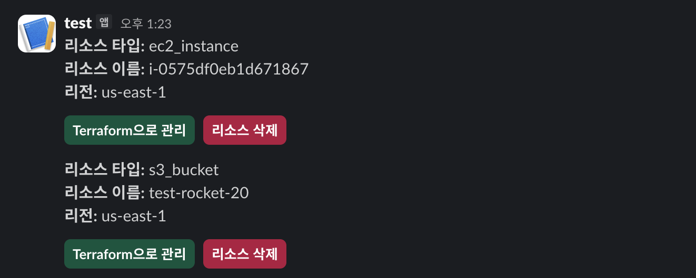
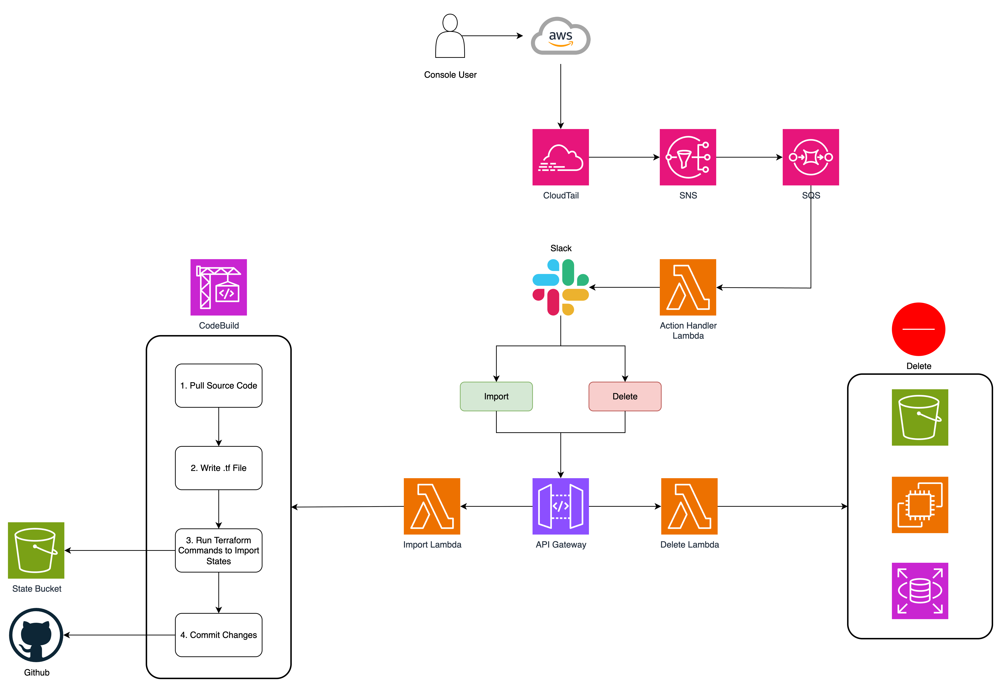

# 자-드가자 : 아, 쫌!

"아, 쫌!" - 개발자들이 AWS 콘솔에서 급하게 리소스를 생성한 후 Terraform apply를 실행했을 때 콘솔에서 만든 리소스가 사라져버려서 절망하며 내뱉는 말입니다.
이런 상황, 한 번쯤은 겪어보셨죠? 장애 대응으로 급하게 AWS 콘솔에서 EC2 인스턴스나 S3 버킷을 만들었는데, 나중에 Terraform을 돌리니까 "어? 내가 만든 리소스가 왜 없지?" 하면서 당황하는 그 순간 말이에요.
바로 이런 문제를 해결하기 위해 탄생한 것이 우리의 "자-드가자" 프로젝트입니다. 더 이상 콘솔에서 만든 리소스 때문에 스트레스받지 마세요!

## 어플리케이션 개요

AWS 콘솔에서 리소스를 생성한 후 Terraform State와 맞지 않아 Terraform apply후에 콘솔에서 만들어진 리소스가 사라져 멘붕에 빠지는 상황을 해결하기 위해 탄생했습니다.

우리의 Terraform State 동기화 서비스는 AWS 콘솔에서 수동으로 생성된 리소스들을 실시간으로 감지하고, 이를 자동으로 Terraform 코드로 변환하여 State에 동기화하는 혁신적인 솔루션입니다. CloudTrail을 통해 새로운 리소스 생성을 즉시 감지하고, Slack을 통해 사용자에게 알림을 보내어 해당 리소스를 Terraform으로 관리할지 삭제할지 선택할 수 있게 합니다.

이 서비스는 Infrastructure as Code(IaC) 환경에서 발생하는 가장 흔한 문제 중 하나인 "드리프트(Drift)" 현상을 해결합니다. 긴급 상황에서 AWS 콘솔을 통해 생성한 리소스들이 Terraform State와 일치하지 않아 발생하는 혼란과 관리의 어려움을 완전히 자동화된 워크플로우로 해결하여, 개발팀의 생산성을 크게 향상시킵니다.

또한 CodeBuild를 활용한 자동 Git 동기화 기능을 통해 팀 전체가 항상 최신 상태의 Terraform 코드를 공유할 수 있으며, S3 원격 백엔드와 DynamoDB 락킹을 통해 안전하고 일관된 State 관리를 보장합니다.

## 주요 기능

어플리케이션의 주요 기능 들을 설명합니다. 가능하다면 각 화면의 캡처를 기반으로 설명 자료를 작성합니다.

1. 콘솔에서 새로운 리소스가 생성되면 slack으로 알림이 받게 됩니다.
2. 관리자는 이를 새롭게 import를 할 지, 삭제를 할 지 선택할 수 있습니다.

## 동영상 데모

Amazon Q Developer로 구현한 어플리케이션의 데모 영상을 입력합니다.
**Git의 Readme에는 GIF 형식으로 업로드하며, 원본 동영상은 발표 Presentation에 제출합니다.**

## 리소스 배포하기

### 1. 사전 요구 사항
- AWS CLI 설치 및 구성
- Terraform 설치 (>= 1.0)
- 적절한 AWS 권한 (S3, CloudFront 관리 권한)
- region은 `us-east-1`로 설정

### 2. Terraform 실행

```bash
# Terraform 초기화
terraform init

# 실행 계획 확인 (버킷 이름 입력 요구됨)
terraform plan

# 인프라 생성 및 파일 자동 업로드 (버킷 이름 입력 요구됨)
terraform apply
```

Terraform 실행 시 버킷 이름을 직접 입력하라는 프롬프트가 나타납니다:
```
var.bucket_name
  S3 버킷 이름 (전역적으로 고유해야 함)

  Enter a value: <고유한 S3 경로를 입력합니다.>
```

### 3. 자동 처리 과정

`terraform apply` 실행 시 다음이 자동으로 처리됩니다:
1. AWS 인프라 생성 (S3, CloudFront 등)
2. `../1. code` 디렉토리의 파일들을 S3에 자동 업로드
3. 파일별 적절한 Content-Type 설정

### 4. AWS 출력 아키텍처

Terraform을 실행 한 후 다음의 정보들이 AWS에 배포되게 됩니다.
- **CloudTrail**: AWS 리소스 생성 이벤트 감지
- **SNS → SQS**: 이벤트 전달 파이프라인
- **Lambda Functions**: 이벤트 처리, 리소스 관리, Slack 알림
- **Slack**: 사용자 알림 및 상호작용
- **API Gateway**: Slack 버튼 클릭 처리
- **CodeBuild**: Terraform import 및 Git 동기화 자동 실행
- **S3**: Terraform State 저장 (원격 backend)
- **DynamoDB**: State locking 및 이벤트 저장소
- **Secrets Manager**: GitHub Token 안전한 저장



### 5. 리소스 정리

인프라를 삭제하려면:

```bash
# S3 버킷 비우기 (필요시)
aws s3 rm s3://<bucket_name> --recursive

# Terraform으로 리소스 삭제
terraform destroy
```

## 프로젝트 기대 효과 및 예상 사용 사례

### 1. 기대 효과
- **🎯 인프라 일관성 보장**: AWS 콘솔과 Terraform State 간의 불일치 문제를 완전히 해결하여 Infrastructure as Code의 진정한 가치 실현
- **⚡ 운영 효율성 향상**: 수동으로 terraform import 명령어를 실행하던 번거로운 작업을 완전 자동화하여 개발팀 생산성 극대화
- **💰 비용 최적화**: 개발자들이 실험 목적으로 생성한 불필요한 리소스를 즉시 감지하고 삭제하여 예상치 못한 AWS 비용 발생 방지
- **🔒 거버넌스 강화**: 모든 리소스 생성에 대한 실시간 추적과 승인 프로세스를 통해 클라우드 보안 및 컴플라이언스 수준 향상
- **🤝 팀 협업 개선**: 자동 Git 동기화를 통해 팀 전체가 항상 최신 상태의 Terraform 코드를 공유하며 일관된 인프라 관리 가능

### 2. 예상 사용 사례
- **🚨 긴급 장애 대응 시나리오** : 새벽 3시 장애 상황에서 AWS 콘솔로 급하게 EC2 인스턴스나 RDS를 생성한 후, 다음날 출근해서 해당 리소스가 Terraform으로 자동 관리되고 있는 것을 확인
- **👥 다중 개발팀 협업 환경** : 프론트엔드 팀이 S3 버킷을 콘솔에서 생성했을 때, 인프라팀이 자동으로 알림을 받고 해당 리소스를 팀 공통 Terraform 코드베이스에 통합
- **🔧 개발/테스트 환경 관리** : 개발자들이 기능 테스트를 위해 임시로 생성한 Lambda 함수, API Gateway, DynamoDB 테이블 등을 자동으로 감지하여 테스트 완료 후 즉시 정리하거나 코드로 보존
- **🎓 교육 및 트레이닝 환경** : AWS 교육 과정에서 수강생들이 콘솔로 실습하며 생성한 리소스들을 강사가 실시간으로 모니터링하고, 교육 종료 후 자동으로 정리하여 비용 절약
