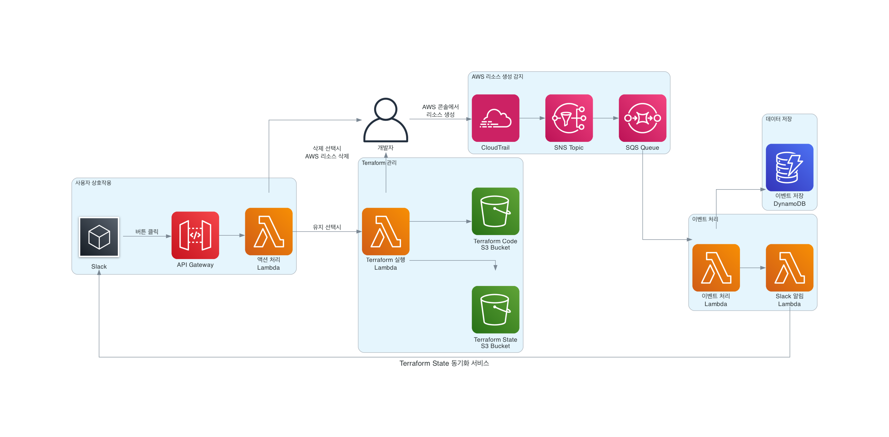

# 자-드가자 : Terraform State 동기화 서비스

Amazon Q Developer Hackathon으로 구현한 AWS 리소스와 Terraform State를 자동으로 동기화하는 서비스입니다.

## 어플리케이션 개요

AWS 콘솔에서 급하게 생성한 리소스들이 Terraform State와 일치하지 않는 문제를 해결하는 서비스입니다. CloudTrail을 통해 새로운 리소스 생성을 감지하고, Slack을 통해 사용자에게 알림을 보내어 해당 리소스를 Terraform으로 관리할지 삭제할지 선택할 수 있게 합니다.

## 주요 기능

### 1. 실시간 리소스 생성 감지
- CloudTrail을 통해 AWS 리소스 생성 이벤트를 실시간으로 감지
- S3, EC2, RDS, Lambda, DynamoDB 등 주요 리소스 지원

### 2. Slack 알림 시스템
- 새로운 리소스가 생성되면 즉시 Slack으로 알림 전송
- 인터랙티브 버튼을 통해 사용자 선택 가능
  - "Terraform으로 관리": 리소스를 Terraform 코드로 변환하고 State에 import
  - "리소스 삭제": 생성된 리소스를 즉시 삭제

### 3. 자동 Terraform 코드 생성
- 감지된 리소스를 적절한 Terraform 코드로 자동 변환
- S3에 저장하여 버전 관리 및 협업 지원

### 4. Terraform State 자동 동기화
- `terraform import` 명령을 통해 기존 리소스를 State에 추가
- `terraform plan` 및 `terraform apply` 자동 실행

## 아키텍처



### 구성 요소
- **CloudTrail**: AWS 리소스 생성 이벤트 감지
- **SNS → SQS**: 이벤트 전달 파이프라인
- **Lambda Functions**: 이벤트 처리, 리소스 관리, Slack 알림
- **Slack**: 사용자 알림 및 상호작용
- **API Gateway**: Slack 버튼 클릭 처리
- **CodeBuild**: Terraform import 및 Git 동기화 자동 실행
- **S3**: Terraform State 저장 (원격 backend)
- **DynamoDB**: State locking 및 이벤트 저장소
- **Secrets Manager**: GitHub Token 안전한 저장

## 리소스 배포하기

### 사전 요구사항
- AWS CLI 설치 및 구성
- Terraform 1.0 이상 설치
- GitHub Personal Access Token (자동 Git 동기화용)

### 배포 단계

1. **GitHub Token 설정**
```bash
aws secretsmanager put-secret-value \
  --secret-id github-token \
  --secret-string '{"token":"your-github-token-here"}' \
  --region us-east-1
```

2. **전체 인프라 배포**
```bash
./deploy.sh
```

배포 순서:
1. `backend/` - Terraform State 관리용 S3 버킷 및 DynamoDB 테이블
2. `s3/` - 소스 코드 저장용 S3 버킷
3. `dynamodb/` - 이벤트 저장용 DynamoDB 테이블
4. `sns-sqs/` - 이벤트 전달 파이프라인
5. `cloudtrail/` - AWS 리소스 생성 감지
6. `lambda/` - 이벤트 처리 Lambda 함수들
7. `api-gateway/` - Slack 상호작용용 API Gateway
8. `codebuild/` - Terraform import 및 Git 동기화용 CodeBuild

### 리소스 삭제
```bash
./destroy.sh
```

### 수동 배포 (선택사항)
각 디렉토리에서 개별적으로 배포 가능:
```bash
cd terraform/backend
terraform init && terraform apply

cd ../s3
terraform init && terraform apply
# ... 순차적으로 진행
```

## 사용 방법

### 자동화된 워크플로우

1. **AWS 콘솔에서 리소스 생성**
   - S3 버킷, EC2 인스턴스 등 생성
   - CloudTrail이 자동으로 이벤트 감지

2. **Slack 알림 수신**
   - 새로운 리소스 생성 알림
   - "Terraform으로 관리" 버튼 클릭

3. **자동 처리**
   - CodeBuild가 자동으로 실행됨
   - Terraform import 및 State 업데이트
   - Git 레포지토리에 자동 커밋

4. **결과 확인**
   - `terraform/s3_bucket/` 디렉토리에 새 `.tf` 파일 생성
   - 로컬에서 `terraform plan` 실행하여 동기화 확인

### 수동 테스트

```bash
# CodeBuild 수동 실행 예시
aws codebuild start-build \
  --project-name terraform-sync-import \
  --environment-variables-override \
    name=RESOURCE_TYPE,value=s3_bucket \
    name=RESOURCE_NAME,value=test-bucket-123 \
    name=RESOURCE_ID,value=test-bucket-123 \
    name=TERRAFORM_CODE,value='resource "aws_s3_bucket" "test-bucket-123" { bucket = "test-bucket-123" }'
```

## 프로젝트 기대 효과 및 예상 사용 사례

### 기대 효과
- **인프라 일관성 보장**: AWS 콘솔과 Terraform State 간의 불일치 해결
- **운영 효율성 향상**: 수동 State 동기화 작업 자동화
- **비용 최적화**: 불필요한 리소스 즉시 감지 및 삭제
- **거버넌스 강화**: 모든 리소스 생성에 대한 추적 및 관리

### 예상 사용 사례

1. **긴급 상황 대응**
   - 장애 대응 시 AWS 콘솔에서 급하게 생성한 리소스들을 사후에 Terraform으로 관리

2. **팀 협업 환경**
   - 여러 개발자가 작업하는 환경에서 누군가 콘솔에서 생성한 리소스를 팀 전체가 관리

3. **학습 및 실험 환경**
   - AWS 콘솔에서 실험하며 생성한 리소스들을 코드로 변환하여 재사용

4. **마이그레이션 프로젝트**
   - 기존 수동 생성된 리소스들을 점진적으로 Terraform으로 이관

5. **비용 관리**
   - 개발자들이 실험 목적으로 생성한 리소스들을 즉시 감지하여 불필요한 비용 방지

## 기술 스택
- **Infrastructure**: AWS (CloudTrail, SNS, SQS, Lambda, API Gateway, S3, DynamoDB, CodeBuild)
- **IaC**: Terraform (Remote State with S3 + DynamoDB)
- **Runtime**: Python 3.9
- **CI/CD**: AWS CodeBuild
- **Version Control**: Git (Auto-commit & Push)
- **Notification**: Slack
- **Monitoring**: CloudWatch (자동 설정)
- **Secrets Management**: AWS Secrets Manager

## 주요 개선사항

- **원격 State 공유**: S3 backend + DynamoDB locking으로 팀 내 State 일관성 보장
- **자동 Git 동기화**: CodeBuild에서 자동으로 커밋 및 푸시
- **완전 자동화**: 수동 개입 없이 AWS 콘솔 → Terraform State → Git 동기화
- **실시간 처리**: CloudTrail 이벤트 기반 즉시 감지 및 처리